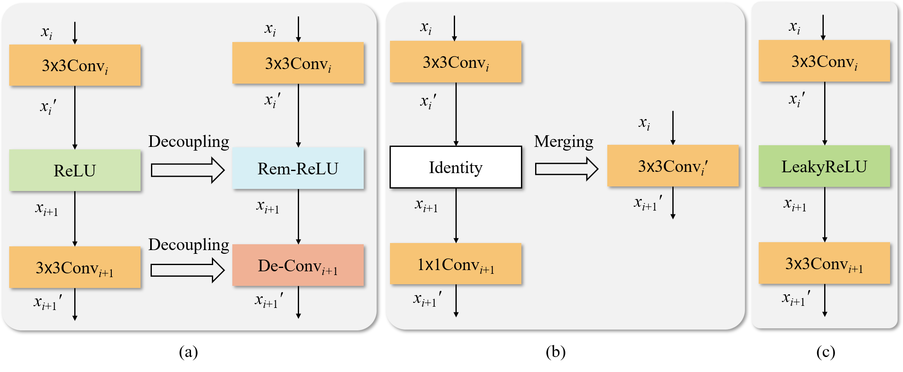

# Efficient Layer compression without Pruning
The code in this toolbox implements the: ["Efficient Layer compression without Pruning"](https://ieeexplore.ieee.org/abstract/document/10214522).

## Overview

The overview of the proposed layer compression method.
(a) Layer decoupling module (replacing nonlinear and convoultional layers with Rem-ReLU and De-Conv)
to enable us readily merge serial layers. (b) Equivalent conversion of parameters to losslessly merge the decoupled network into a shallow network. (c) When
the layers cannot be merged, Rem-ReLU is equivalently converted to LeakyReLU and De-Conv is re-parameterized into a new vanilla convolutional layer.

## Training

```
python train_rep_layers.py --cfg models/resnet34.yaml --name resnet34-rep-layers --weights runs/train/resnet34/weights/best.pt --batch-size 128  
```

## Evaluation
```
python val.py --cfg models/resnet34.yaml --weights runs/val/resnet34/model_prunerate42.pt --name resnet34
```

## Citation

   If you find our repo useful for your research, please consider citing our paper:

   ```bibtex
   @ARTICLE{10214522,
  author={Wu, Jie and Zhu, Dingshun and Fang, Leyuan and Deng, Yue and Zhong, Zhun},
  journal={IEEE Transactions on Image Processing}, 
  title={Efficient Layer Compression Without Pruning}, 
  year={2023},
  volume={32},
  number={},
  pages={4689-4700},
  doi={10.1109/TIP.2023.3302519}}
   ```